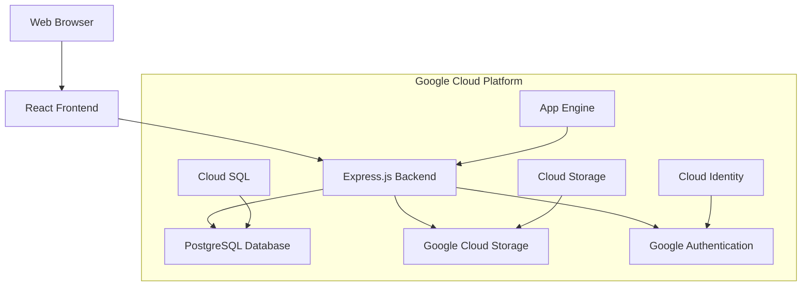

# Smart To-Do List Application

A full-stack intelligent to-do list application built with React, Node.js, and Google Cloud Platform.

## 🚨 Current Project Status

**⚠️ IMPLEMENTATION PHASE: Project is currently in documentation-complete status with no implementation started.**

- **Project Phase:** Documentation Complete, Implementation Pending  
- **Overall Progress:** 25% Complete (Documentation only)
- **Next Steps:** Begin Phase 1 Development Environment Setup

📊 **[View Detailed Project Status](./docs/project/PROJECT_STATUS.md)** - Current blockers, issues, and next steps  
🗺️ **[Implementation Roadmap](./docs/project/IMPLEMENTATION_ROADMAP.md)** - 8-week implementation plan

### 🚨 Critical Blockers Requiring Immediate Attention

1. **No Implementation Started** - Project exists only as documentation
2. **Missing Development Environment** - No actual codebase to work with  
3. **Google Cloud Setup Not Initiated** - Cloud infrastructure not provisioned

### 🔧 Immediate Next Steps Required

**Phase 1 (Week 1):** Development Environment Setup
```bash
# Create project structure
npx create-vite@latest frontend --template react-ts
mkdir backend && cd backend && npm init -y
mkdir shared && cd shared && npm init -y
```

**Phase 2 (Week 1-2):** Google Cloud Infrastructure
```bash
# Provision cloud resources
gcloud auth login
gcloud config set project smart-todolist-471817
gcloud sql instances create todolist-db --database-version=POSTGRES_14
```

**See [Implementation Roadmap](./docs/project/IMPLEMENTATION_ROADMAP.md) for complete 8-week plan.**

## 📚 Documentation Hub

**New to the project?** Start with our [Documentation Index](./DOCUMENTATION_INDEX.md) for organized access to all guides and resources.

### Quick Access
- **🚀 [Installation Guide](./docs/installation-guide.md)** - Complete setup instructions
- **📋 [Quick Start Checklist](./docs/quick-start-checklist.md)** - Step-by-step setup
- **👥 [User Manual](./docs/user-guides/user-manual.md)** - Complete user guide
- **🛠️ [Contributing Guidelines](./docs/contributing/README.md)** - How to contribute
- **🐛 [Troubleshooting](./docs/troubleshooting/common-issues.md)** - Fix common issues
- **❓ [FAQ](./docs/troubleshooting/faq.md)** - Frequently asked questions

## Features

- 🧠 Smart task categorization and prioritization
- 🔄 Real-time synchronization across devices  
- 🤖 AI-powered task suggestions and scheduling
- 📱 Mobile-responsive web interface
- ☁️ Cloud-based data storage and backup
- 🔐 Secure user authentication
- 📎 File attachments support
- 🎨 Customizable categories with color coding
- 📊 Task analytics and insights
- 🔍 Advanced search and filtering

## Technology Stack

- **Frontend**: React 18 with TypeScript, Vite, Tailwind CSS
- **Backend**: Node.js, Express.js, TypeScript
- **Database**: Google Cloud SQL (PostgreSQL)
- **Cloud**: Google App Engine, Cloud Storage
- **Authentication**: Google OAuth2 with JWT
- **State Management**: Zustand
- **Styling**: Tailwind CSS with Radix UI components

## Architecture



For detailed architecture information, see [Architecture Overview](./docs/architecture/overview.md).

## Service Account

This application uses the Google Cloud service account: `smartlist@smart-todolist-471817.iam.gserviceaccount.com`

## Quick Start

### For New Users
1. Read the [User Manual](./docs/user-guides/user-manual.md)
2. Visit the application website
3. Create an account or sign in with Google
4. Start creating and organizing your tasks!

### For Developers
1. **Installation**: Follow the [Installation Guide](./docs/installation-guide.md)
2. **Quick Setup**: Use the [Quick Start Checklist](./docs/quick-start-checklist.md)  
3. **Development**: See [Copilot Instructions](./.copilot-instructions.md) for detailed development guide
4. **Contributing**: Read [Contributing Guidelines](./docs/contributing/README.md)

### For Administrators
1. **Setup**: Follow [Infrastructure Guide](./docs/infrastructure/README.md)
2. **Security**: Review [Security Guidelines](./docs/admin/security.md)
3. **Monitoring**: Set up [Monitoring & Logging](./docs/deployment/monitoring.md)

## Project Structure

```
ProjectA/
├── 📁 docs/                      # Comprehensive documentation
│   ├── 📁 architecture/          # System architecture docs
│   ├── 📁 api/                   # API documentation  
│   ├── 📁 user-guides/           # User manuals and tutorials
│   ├── 📁 contributing/          # Contribution guidelines
│   ├── 📁 troubleshooting/       # Help and troubleshooting
│   └── 📁 templates/             # Documentation templates
├── 📁 infrastructure/            # Cloud deployment configs
├── 📄 README.md                  # This file
├── 📄 DOCUMENTATION_INDEX.md     # Main documentation index
├── 📄 CHANGELOG.md               # Version history
└── 📄 .copilot-instructions.md   # Detailed development guide
```

## API Documentation

Comprehensive API documentation is available at [docs/api/README.md](./docs/api/README.md), including:
- Authentication endpoints
- Task management APIs
- Category operations  
- File upload handling
- Error codes and responses
- SDKs and client libraries

## Development Workflow

```bash
# Clone the repository
git clone https://github.com/nibertinvestments/ProjectA.git
cd ProjectA

# Follow installation guide
open docs/installation-guide.md

# Or use quick start checklist
open docs/quick-start-checklist.md
```

## Support & Community

### Getting Help
- **📖 Documentation**: Start with [Documentation Index](./DOCUMENTATION_INDEX.md)
- **❓ FAQ**: Check [Frequently Asked Questions](./docs/troubleshooting/faq.md)
- **🐛 Issues**: Report bugs via GitHub Issues
- **💬 Discussions**: Join GitHub Discussions for questions

### Contributing
We welcome contributions! Please see our [Contributing Guidelines](./docs/contributing/README.md) for:
- Code contribution process
- Documentation standards
- Testing requirements
- Code review guidelines

## License

This project is licensed under the MIT License - see the [LICENSE](LICENSE) file for details.

## Changelog

See [CHANGELOG.md](./CHANGELOG.md) for version history and release notes.

---

**📚 Complete Documentation**: [DOCUMENTATION_INDEX.md](./DOCUMENTATION_INDEX.md)  
**🚀 Quick Start**: [Installation Guide](./docs/installation-guide.md)  
**👥 User Guide**: [User Manual](./docs/user-guides/user-manual.md)  
**🛠️ Developer Guide**: [Copilot Instructions](./.copilot-instructions.md)
